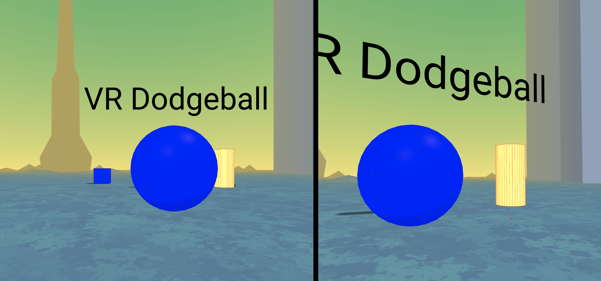

## Blog Post #3 - Starting work on MVP - April 22nd, 2021

All applications described can also be found in the notes section.

### What we accomplished

This week we split into 2 groups. One group worked on building a Croquet application with voice chat and physics, and the other group worked on writing a component that would allow players to pick up and throw balls in a more natural-feeling way.

#### Voice Chat and Physics With Croquet

A link to an app demonstrating this feature can be found [here](https://cate-edit.glitch.me/).

Below is what a room might look like when you enter: 
The left hand and right hand side correspond to different players - where they both see eachother. To use the demo in the browser - you are able to use the wasd keys. To use the demo in VR mode - you can use the joysticks. You are also able to pick up the cubes and the sphere in the room and throw/drop/stretch them (using superhands). We have superhands in use at the moment - but next week plan on changing this to use Eddie + Akash's code.

The blue balls represent users and when entering the same room, players are now able to hold conversations with each other over voice chat. When you move to the other side of another player, you will also be able to hear the voice coming from that direction. You are able to see the players position update in real time as well.

Users are able to interact with objects - where the other players in the room do not go through the objects. One issue we had was that the object positions are not all the same in each users view (blocking issue). This demo however shows a few key features - such as croquet with aframe-physics, voice integration and users being able to join the same room with user positions being updating in real time. To unblock ourselves (croquet team: Timothy & Clarisa) with object positions not being consistent across user views - we plan to email our mentor this week and spend more time in office hours. As our workload for next week was planned to work on integrating Eddie & Akash's work with superhands and this week involved more coding - we plan to take advantage of the additional buffer time we planned.

#### Throwing Balls

In our rapid prototype app, we had implemented throwing in a naive way. Previously, a user can pick up a ball and when releasing it, the velocity of the ball is set to the velocity of the controller and then multiplied by some scalar. This led to some unintended behavior where if you released the ball after picking it up, even with no throwing motion, the ball would move much more quickly than expected. Additionally, the "Superhands" module had a significant delay between when you move your hand and when the grabbed ball is moved. This led to issues where if you moved your hand too fast, the ball would end up being too far away from your hands, ending the grab. When combined with the above naive implementation of throwing, the ball would sometimes shoot off in an unknown direction.

This week, we implemented our own throwing and grabbing system that aimed to solve this issue. A link the the new demo can be found [here](https://aba1.glitch.me/). Here, the ball tracks the motion of the controller with a nearly unnoticable delay so that it is impossible to lose your grip on the ball from jerky motions. Throwing has also been improved so that we now track the position of the ball from the last few frames before the ball is released to determine the throwing velocity. This led to a much more natural feeling throw and normal behavior when the you drop the ball.

### Individual work log

- **Clarisa:** I [remixed](https://cate-edit.glitch.me/) Timothy's [original demo](https://super-hands-croquet.glitch.me/) which enabled multiple users to join a room and you could see the users movement in real time. My changes included adding networked audio in the room - so now users can chat with one another through the microphone in a discord style. This was based on the provided [demo](https://glitch.com/edit/#!/uwrl-networked-aframe-audio) for networked audio given to the class. After that - Timothy and I started work together to implement the croquet logic for having an entity/object's position update for all users in the room when one user interacts/moves the object in the room. We implementing the Model/View code but need to debug it this weekend more. I also implemented movement controls in our remixed glitch project so users can also move around the room with their joysticks.

- **Akash:** I worked on our implementation of hands in VR with Eddie. We tried various different implementations of tracking the position of the ball and hand and using it for throwing to get the most natural feel. It still requires some fine tuning but the throws already feel much better than with superhands.

- **Eddie:** I worked on the updated throwing app with Akash. We focused on making throwing feel more natural by tracking the throwing motion rather than the instant the ball is released and trying to get the ball to follow the motion of the controller more precisely.

- **Timothy:** I modified the [Croquet + Physics + Super Hands demo](https://super-hands-croquet.glitch.me/) so that users can see other users moving around inside a WebXR session. Users can also throw objects at the users (with super hands) and hit them, although collision detection is still unimplemented. After Clarisa [remixed this demo](https://cate-edit.glitch.me/) and added voice control, we worked on modifying the demo to publish the location of a black sphere (see [Voice Chat and Physics with Croquet](#voice-chat-and-physics-with-croquet)).

### Plans for next week

Next week, we plan on combining the parts we worked on this week to create a basic game where multiple players can speak and throw items at each other. Timothy and Clarisa will also continue work on making sure that objects positions are updated in real time for all user in the room.

### Blocking issues

- One blocking issue on the croquet side (Timothy + Clarisa) is that we are having trouble having object's positions publish in real time in the room. What happens is that users are not correctly all seeing the same view of the objects in the room (i.e. - same positions, etc). We have it so that users can all see everyones position update correctly (blue sphere) however. We plan on going to OH next week and working on it this weekend as well but for now it is a blocker.

### Notes

- [Old Croquet and Physics demo](https://super-hands-croquet.glitch.me/)
- [Voice Chat and Physics Demo - added logic for entities positions to be updated](https://cate-edit.glitch.me/)
- [Updated Throwing App](https://aba1.glitch.me/)

### Delivarables

None this week.
