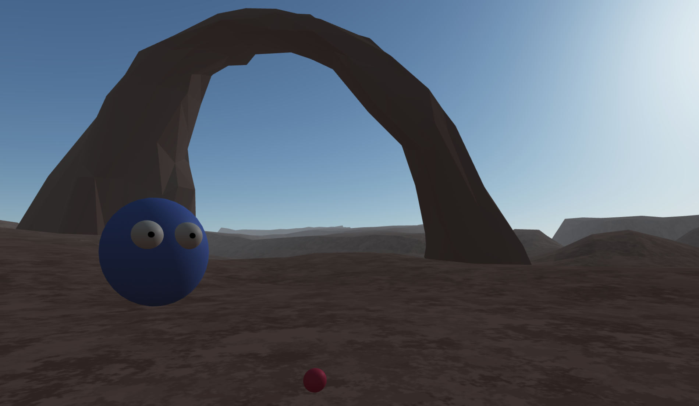

## Blog Post #4 - Continuing work on MVP - April 29th, 2021

All applications described can also be found in the notes section.

### What we accomplished

This week we mostly focused on [our blocking issue from last week using Croquet](/xrcapstone21sp-team1/blog3#blocking-issues), which was updating the positions of objects for all users, creating the illusion that all users are in the same room. We also worked on adding our own throwing and grabbing system to our demo from last week which uses aframe's physic system. Additionally, we developed a new demo as an alternative to using Croquet for multiplayer (after researching Croquet extensively) using networked aframe where users are able to collaboritvately join a room and pick up/throw spheres. We decidied to switch to developing this new demo for our MVP - where our work log for what is needed to complete our MVP can be found in the section "Plans for next week" of this blog post.

#### Physics updates and collision detection with Croquet

We modified our [old demo](https://cate-edit.glitch.me/) in-place, so the link is the same.

At the time of this writing, this demo is only configured to update the position of the yellow cylinder. This is for debugging purposes (it's much easier to read one object's logs than five of them!), although our program is set up to make updating additional objects easy.

##### Issue #1: Positions weren't updating at all

The first issue we encountered was that the positions of objects weren't being updated at all. This obviously wasn't a great sign.

Our program is set up to only update the positions of objects when they move, as this method is more efficient. We do this by comparing the matrices stored in the model and in the view. Unfortunately, this comparison was written incorrectly, causing no updates to ever be published:

Correcting the comparison resolved this issue.

##### Issue #2: The objects would move indefinitely

The next issue we found was that objects would keep moving after a collision, even long after they would've normally stopped:

After some debugging, we found that this was because of a race condition where two views would try to update the position of the same object at once. To minimize the chances of this happening, we are working on a new system that only updates the position when there's a collision or a user picks up/catches a ball. The advantage of this system is that we can reduce the number of times when multiple views would try to update an object's position at once.

#### Networked AFRAME Demo

Due to the issues with integrating Croquet with AFRAME physics and issues with object synchronization discovered by Clarisa & Timothy over the past couple of weeks - the team decided to switch to using [Networked AFRAME](https://github.com/networked-aframe/networked-aframe) for multiplayer. Our demo can be found [here](https://aba11-edit.glitch.me/) on glitch. In the demo - users are able to collaboritively join the room and in VR mode - use the grip functions on the Oculus controller to pick up and throw dodgeballs which are spawned around the room (integrates Eddies + Akash's code from last week). Additionally - voice is integrated as well.

In the picture above - we see a view of another user in the room. In VR Mode to interact with the red dodgeballs in the room - users just use the grip controls on the oculus controller to either grab or throw them.

### Individual work log

- **Clarisa:** I worked on modifying our Croquet + Physics + Voice demo from last week to integrate Eddie + Akash's code for throwing/grabbing balls and removing the superhands code we initially had. The demo can be found [here](https://cate-edit-2.glitch.me/) - although it is currently not working and we would need to debug it more thorougly. Based on what I see is that we correctly recieve the grab event when a user tries to grab a ball and the distance from the ball is within grab range - however for some reason the grab event doesn't occur (possibly due to a Croquet issue). I also researched more about Croquet and met with Timothy to discuss how to improve our Croquet demo. I also met with Akash and Eddie - they were able to work on another version of our project without Croquet and using networked aframe for multiplayer. I then reviewed their code to understand it more thorougly and integrated voice into their code and started work on synchronizing the positions of all the balls & collision detection. The plan for the weekend is to work together and finish our MVP on this version using networked aframe over croquet!

- **Akash:** I worked with Eddie to try a different approach to multiplayer using the a-frame networked component that we were already using for our voice functionality. The demo can be found [here](https://aba11.glitch.me/). We were able to get a nice system that can throw and simulate physics (except for some edge cases we have to handle) for all players in the same way. While our initial plan was to use croquet, this system seems a lot better and less buggy and also works really well with our current hands component.

- **Eddie:**

- **Timothy:** I worked on updating last week's demo to publish the positions of each object, as [described above](#physics-updates-and-collision-detection). I also modified the demo to update the orientation of each user, so you can see when other users turn:

Although the users are spheres, you can see them "rotate" when the red dots (representing their physics bodies) move.

### Plans for next week

We plan on finishing the MVP by May 4th. We will be working over the weekend as well.

Networked aframe for multiplayer (TODO for MVP):
 - Handle collision of dodgeballs and users (elimination event - main concern i.e. high priority)
 - Work on improvements for dodgeball generation / logic (medium priority)
 - Polish demo for MVP if time (low priority)

If we decide on continuing to use Croquet for multiplayer - this will entail:
 - Updating the demo to publish each object's position, including dodgeballs
 - Finish integrating our throwing system with Croquet 
 - Notify users when they've been hit by a dodgeball 

### Blocking issues

Our biggest blocking issue is (still) publishing the positions of objects through Croquet in a manner that avoids race conditions. This is only an issue if we keep using Croquet, however.

### Notes

- [Original Voice Chat and Physics Demo - added collision detection for individual entities](https://cate-edit.glitch.me/)
- [Voice Chat and Physics demo, but with our own throwing system added (Not Complete and contains object positions bug)](https://cate-edit-2.glitch.me/)
- [Networked Aframe, Networked Audio, Physics Throwing Demo](https://aba11-edit.glitch.me/)

### Deliverables

None this week.
