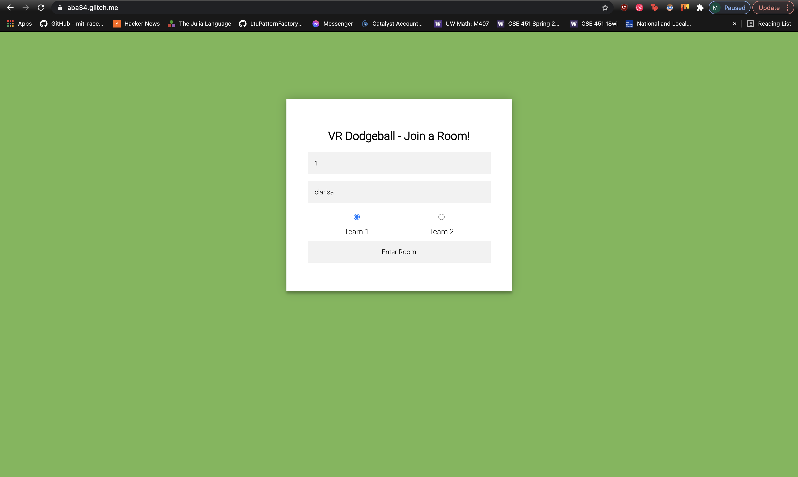
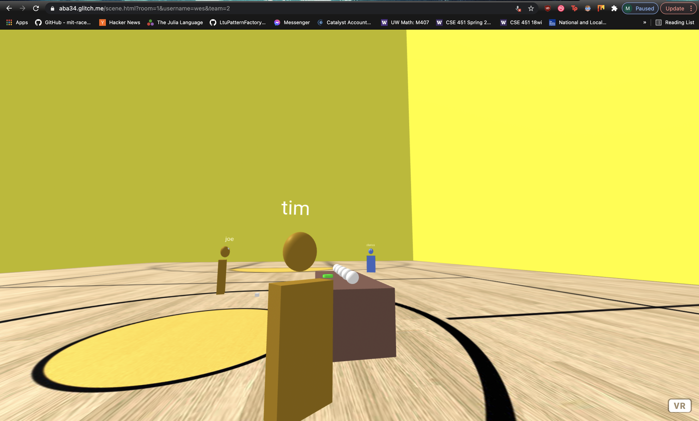
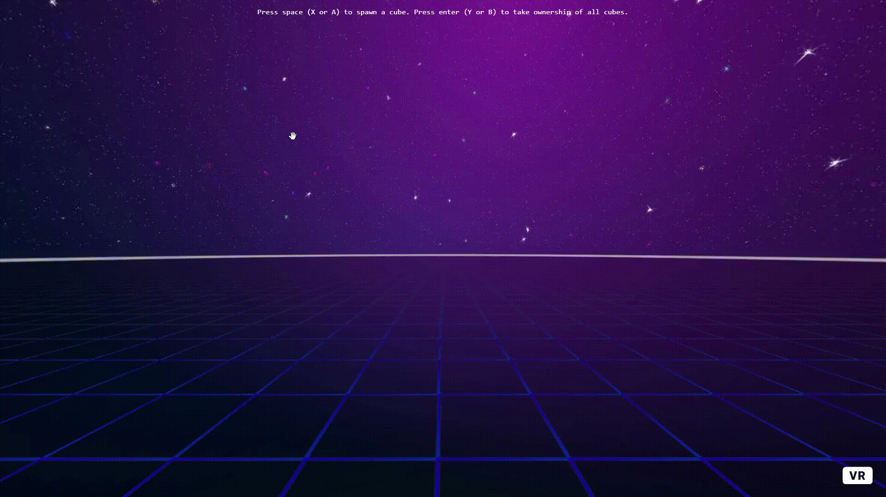

## Blog Post #6 - Working on our target product - May 13th, 2021

### What we accomplished
After finishing up our MVP last week - this week we started work on our target product. We continued work on avatar customization, menus, maps, and started work on implementing another game mode (classic dodgeball). In addition - our PRD has been modified slightly to move the work for power-ups to week 9 and move up the work for implementing different game modes to week 7 and 8.

#### Avatar Customization, Rooms, Teams, and Classic Dodgeball Game Mode
We finished work on rooms so that users are able to specify which room they want to join, the team they want to play on (i.e. - picking 1 of 2 available teams), and their username. Their username and avatar color (which is specific to which team they have selected) will be synced for all users in the room. Multiple matches of dodgeball are able to be played as there are multiple rooms as well. With the addition of teams - we also started work on implementing teamed dodgeball (i.e. - classic mode). This mode allows users to play the classic game of dodgeball we are all familiar with - where users are placed on teams and the goal is to eliminate all of the other players on the other team. We also worked on improving the map for classic dodgeball mode.

Above shows the form where users are able to specify which room they want to join, their username, and which team they'd like to play on.

Above shows what it looks what when a player would join a room. The orange users are on team 1 while the blue users are on team 2. Additionally - all usernames are synced across all player views. In addition - we added the game logic where users are not able to eliminate their own team members and instead are only able to eliminate players from the opposing team.

#### In-Game Menus
We also continued work on in-game menus, specifically allowing multiple users to modify the same menu. To do this, we implemented a system where any user can press a button to spawn the menu, which displays it to all users (the menu is hidden by default). The user that spawned the menu starts with ownership of the menu, which means that they are the only user who can edit its settings. To take ownership, another user can click on the menu (using `laser-controls`):

Right now, the cube represents a menu (since the primary focus was networking, the visual aspects were a lower priority) and it works like a toggle button - red means that the option is selected, and any other color means that the cube isn't selected. This is shown from the perspective of one user who watches as another user takes ownership and changes its color.

There is also a toggle button pictured - in the future, we want to update the menu to be more pleasing to the eye and are currently researching aframe GUI libraries.

### Individual work log

- **Clarisa:** I spent some time working on redoing our video for our MVP as requested by the staff. I also worked on looking for dodgeball court models to use for classic mode. Additionally - I worked on avatar customization and this blog post as well/was team lead.

- **Akash:** I worked on fixing our blocking issue from last week to handle lag. We implemented a system where the last user to interact with a ball is the master of that ball, and the thrower always detects collisions instead of the person being hit. This way since the person doing the corrections is the one detecting the collisions, there is no race condition where they don't detect a collision. I also worked with Eddie to implement classic mode, and implemented the game logic behind teams. We also had a major blocking issue where colors and usernames were not syncing. I contacted the people from NAF on slack and it turns out it is a race condition due to the NAF schemas not being registered before it starts syncing. After adding a workaround, everything was syncing correctly. Finally, we worked on making usernames always face the camera so that everyone can always see everyone else's usernames.

- **Eddie:** I worked on implementing classic mode with Akash. We made it so that a user can specify a team upon joining a room. User colors would then be set and you would not be able to knock out those on the same team as you. You would still be able to knock out those on opposing teams. We also added nametags that rotated so that you would always be able to see another player's name regardless of the direction they are facing.

- **Timothy:** I worked on implementing [in-game menus](#in-game-menus) as described above. One issue I encountered was that networked aframe performs better when entities are created after the DOM loads, rather than being explicitly declared in HTML. To solve this, I made the menus are hidden by default. Another issue that I am currently working on is that the [aframe gui library](https://github.com/rdub80/aframe-gui) that I am currently working on does not work with networked aframe very well, so the menus will likely be manually updated.

### Plans for next week
We are a bit behind on our initial plans from our PRD. However - we think that the work we have done this week has been helpful in laying the foundation for a smooth and friendly user experience which is what we aiming for in our target product. Additionally - there have been some unforseen setbacks in avatar synchronization which took time to debug. The plan this weekend is to finish up classic mode including the map so that it looks more polished and fancy. Next week we aim to start work on capture the flag and finish in-game menus - where we have slightly modified our PRD to have implementing power-ups moved to week 9.

### Blocking issues
- None

### Notes
- None

### Deliverables
- [Demo for this week](https://aba34.glitch.me/)
