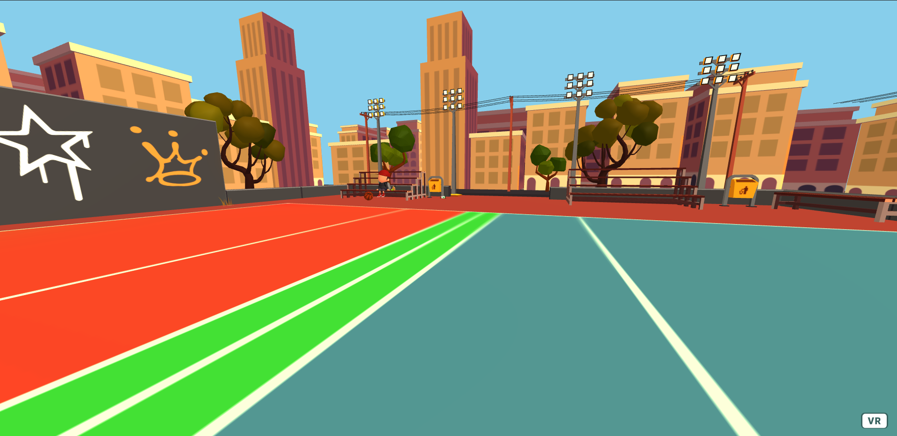

## Blog Post #7 - Wrapping Up Classic Mode - May 19th, 2021

### What we accomplished
Last week, we added the ability for players to specify a team that they wanted to be on and made it so that balls would not knock out players on the same team. This week, to wrap up classic mode, we implemented the rules of the game along with adding a nice looking map and avatar. The networked in-game menu was also completed. Next week, we will also be integrating it with the classic mode demo so that users do not need to specify a team before joining the room.

#### Classic Mode Rules
- When the game starts, all balls are lined up at the center of the court
- Players may then rush towards the center to grab the balls
- When a ball is first grabbed at the start of the game, it is not considered live. Instead, the ball must first move behind the team's attacking line before it may be considered live.
  - Balls that have not moved behind the attacking line will not be considered live even if you hit an opponent with it
- A ball is considered live after it has crossed an attacking line at least once and has been thrown by a player
- Balls are no longer live after they hit any non-player surface
- A player that is hit by a live ball from an opposing team is knocked out, unless that player catches it.

#### The Map
We found a 3D model online that we thought would make a nice map. A screenshot of the top-down view can be found below:

Overall, this is how the map looks in game:

Now that we had a nice looking map, we needed to add boundaries so that players can't just walk off the court. We did this by creating a simple NavMesh, and then constrained the movement controls so that must follow the NavMesh. At this point, although players can no longer use the joystick to move beyond the map, nothing would stop them from physically stepping outside the map by moving in the real world. We resolved this by moving the player back into the exact point that they stepped out of the map. One issue with this is that if a player repeatedly attempts to leave the map, they may feel some motion sickness. However, given that players should not be attempting to leave the map too often, we do not consider an issue that we need to address immediately.

#### Avatars
We previously received some feedback to make "better looking" avatars. Thanks to Akash, we now have a very nice looking avatar designed in Blender:

Later on, we intend to add more colors and more avatars. But moving away from our original cube and sphere avatar makes it much more difficult to indicate a player's death. Previously, we would simply change the color to be red, but changing the color is not as easy when using models as it would require us to switch out the model to a different colored one. Instead, we are considering just changing the nametag to a red font or adding some marker above the player to indicate that they have died to everyone.

#### Menus
We created an in-game menu demo that would allow users to specify a team. The menu will then show all the users that have joined a specific team. Next week, we plan on combining that demo with the classic mode demo.

### Individual work log

- **Clarisa:** This week I worked on created the flag assets for capture the flag in Blender and also worked on documenting our code/cleaning it up a bit. I also worked on preparing for demo day and started work on trying to modify the map asset for capture the flag.

- **Akash:** I worked on completing classic mode with Eddie. We modified the map that we got for classic mode to include a dodgeball court, to have enough performance, and created a NavMesh for it. I also created some robot avatar models that look a lot better than our previous avatars.

- **Eddie:** I worked on completing classic mode with Akash. We designed the map as well as implemented the boundaries that constrained both the balls and the avatars. We also implemented the basic rules of classic dodgeball.

- **Timothy:**

### Plans for next week
We were planning on having classic mode completed by last week at the latest, so we have fallen pretty far behind our initial PRD. However, we spent a significant portion of time figuring out how to implement working map boundaries, so we expect the next week to go very quickly. Next week, we intend to implement capture the flag with an additional map, but given that we have fallen behind, there is a chance that we will not have time to implement power-ups.

### Blocking issues
- None

### Notes
- None

### Deliverables
- [Demo for this week](https://aba40.glitch.me/)
