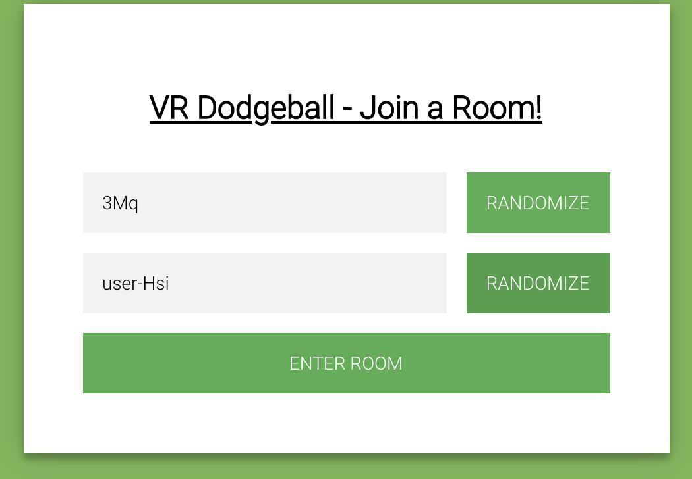

## Blog Post #8 - Starting Capture the Flag Mode - May 26th, 2021

### What we accomplished
This week, we began work on the capture the flag mode. Specifically, we finished work on a new map and NavMesh, as the capture the flag mode needs a more open field than classic mode. We also began working on implementing the new ruleset and finished integrating the networked menus from last week. Next week, we plan to finish up classic mode and begin working on another game mode.

#### The capture the flag map
We found another 3D model online that we plan on using as the map for the capture the flag mode. Here is a screenshot of what the map looks like inside the game:

Like the classic map, we also added a NavMesh to keep players from walking too far (in this case, walking off of a cliff). This was implemented in a similar manner to the classic map, where neither the joystick nor physical movement can cause the player to exit the boundaries of the NavMesh.

#### Menu integration
Last week, we had two separate demos - one for classic mode, and another for a menu that players could use to choose teams. This week, we successfully combined the two demos into [a single application](https://aba44.glitch.me/):

When the page loads, the menu opens automatically and the user is assigned to a team (team assignment alternates between the two teams). After joining a team, the avatar teleports to the appropriate side and changes color (we do this by switching out the models). Everything is networked, so when one player joins a team, all the other players in the same room see the change.

Additionally, we replaced the green start button with the start button in the menu as shown above. When the user clicks on it, the menu is hidden and the balls are spawned.

### Form updates

Because we moved the team choosing functionality from the form (which is not shown in VR) to the networked menu (which is shown in VR), we had to update the form. For ease of use, we also added buttons that let the user randomize the room and user name:

Above is a screenshot of the form showing what the randomized room and user names could look like.

#### Additional improvements
As mentioned last week, changing the avatar makes indicating when a player has died much more difficult. In the end, we decided to briefly change the nametag color to red before the player disappears entirely.

### Individual work log

- **Clarisa:**

- **Akash:**

- **Eddie:**

- **Timothy:** I worked on integrating the menus with classic mode, including handling teleportation, making the menu display on startup, and making players join automatically. I also added a drop down menu for selecting the game mode to use (although the drop down doesn't actually change anything yet).

### Plans for next week
We initially planned to start working on power ups this week, so we are still behind our PRD. Our plan for next week is to finish up capture the flag and begin working on a third game mode (probably protect the point). Because we no longer have menus to integrate, we hope that this process will go by faster than in previous weeks, because there won't be as many action items dividing our attention. Also, one of our team members should have much more free time after the 31st (the final project for another class is due then), which should hopefully increase our productivity.

### Blocking issues
- None

### Notes
- None

### Deliverables
- [Demo for this week](https://aba44.glitch.me/)
