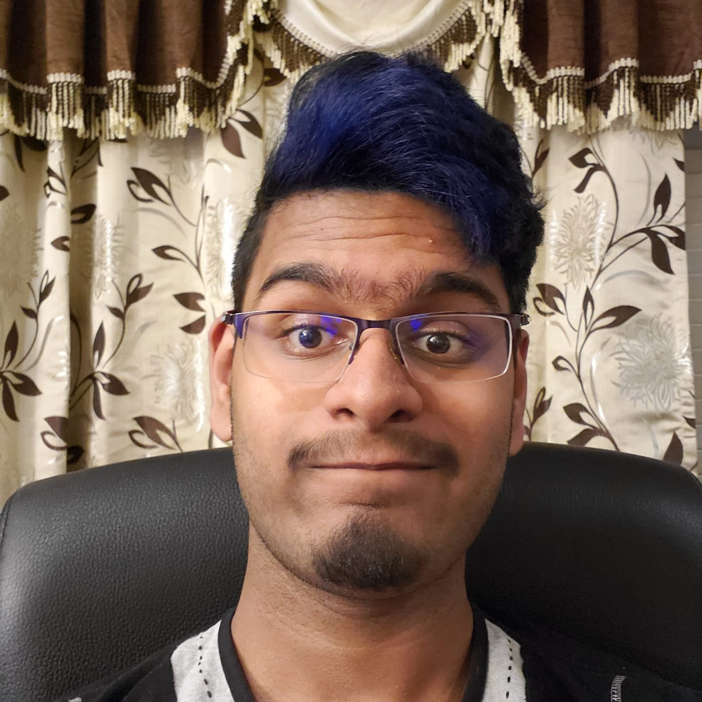

<link rel="stylesheet" type="text/css" media="all" href="css/markdown_styles.css" />

# What is VR Dodgeball?

VR Dodgeball is a networked multiplayer game  built with AFRAME where players can play virtual dodgeball. This gives people a fun way to exercise and destress, and interact with others, especially in a pandemic where in-person games of dodgeball aren't as practical. VR Dodgeball is currently available on the Oculus Quest 2. 

Learn more by watching [our PR Video](https://youtu.be/HoFF9onY47g).

Read more by visiting [our blog](/xrcapstone21sp-team1/blog).

Demo our project with all of our most recent additions [here](https://aba49.glitch.me/). Note: only available for play on the headset.

View our code on [Github](https://github.com/UWRealityLab/xrcapstone21sp-team1/tree/master/app).

# About the Team

<table>
    <tr>
        <td> Clarisa </td>
        <td> Timothy </td>
        <td> Akash </td>
        <td> Eddie </td>
    </tr>
    <tr>
        <td>
             
            
Clarisa - Senior double majoring in Computer Engineering and ACMS (Discrete Mathematics & Algorithms).

        </td>
        <td>
             
            
Timothy - Senior majoring in Computer Science.
            
        </td>
        <td>
             
            
Akash - Senior majoring in Computer Engineering.
            
        </td>
        <td>
             
            
Eddie - Also a senior majoring in Computer Science.
            
        </td>
    </tr>
</table>
